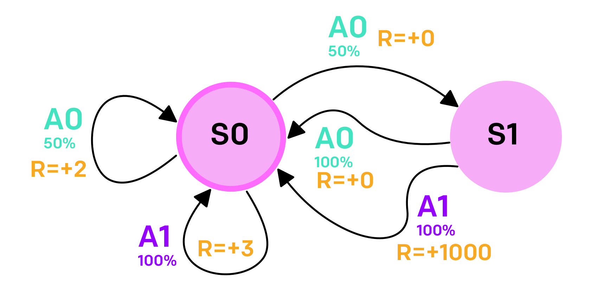

# Markov Decision Process Guess Game

Simple toy example in which the player interacts with a
[*Markov Decision Process* (MDP)](https://onlinelibrary.wiley.com/doi/book/10.1002/9780470316887)
and tries to guess from the returned states and rewards what the optimal policy would be.

The MDP scripted inside is the following:

The code is thoroughly commented and can easily be adapted to any MDP.
